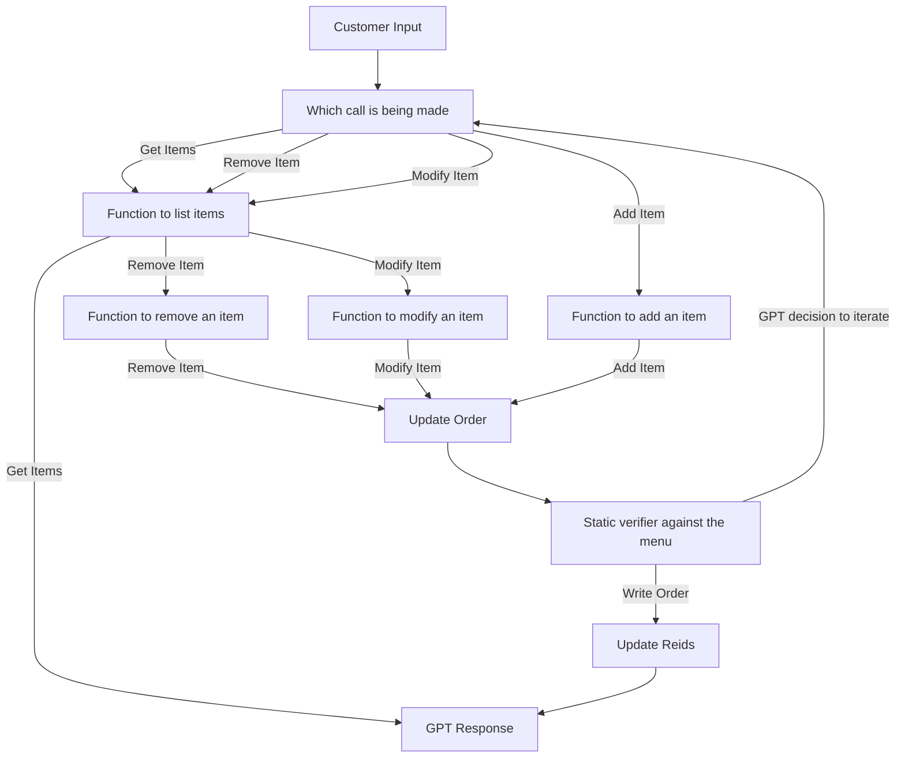

# INFO

## Overall Architecture


Basically, I just use the Assistants API in the OpenAI platform to create the state machine-ish thing above. I had considered doing this all manually through function calls, but realized that the Assistants API would do everything I wanted to do an better. I organize the message history through threads (but maintain a cache locally to avoid unnecessary calls). GPT is able to decide for itself when it needs to look back at the source of truth through the `list` function, or what it needs to modify/add in order to complete the order. It is also able to do this iteratively against a verifier for each of the items. I think there are opportunities to improve the prompting in the verifier/checking completeness of all the aspects that can be verified.

## Iterative Processing
This is example of one gnarly invocation of `/chat` where the gpt searches to find a vegetarian/vegan option in the menu.
```
app-1    |   2024-12-28T07:48:12.563327Z  INFO  Creating new run for thread thread_7gOKQWS3R6nczkEzzOwi8utW
app-1    |   2024-12-28T07:48:25.502021Z  INFO  Run requires action. Thread ID: thread_7gOKQWS3R6nczkEzzOwi8utW, Run ID: run_SN2nUaeENuaPuvs56jeW03Qc, Order ID: cc33906e-3982-460a-8061-fc6640ba6bf6
app-1    |   2024-12-28T07:48:25.502085Z  INFO  Processing function call: add_item
app-1    |   2024-12-28T07:48:25.502118Z  INFO  Executing function: AddItem
app-1    |   2024-12-28T07:48:25.502132Z  INFO  Adding item 'Veggie Burger' to order
app-1    |   2024-12-28T07:48:25.502152Z  INFO  Successfully added item 495461ea-61cb-4fd9-a3af-9c35e4868845 to order
app-1    |   2024-12-28T07:48:25.502172Z  INFO  Item not found in menu: Veggie Burger (ID: 495461ea-61cb-4fd9-a3af-9c35e4868845)
app-1    |   2024-12-28T07:48:25.502186Z  INFO  Function execution completed successfully
app-1    |   2024-12-28T07:48:25.502220Z  INFO  Processing function call: add_item
app-1    |   2024-12-28T07:48:25.502234Z  INFO  Executing function: AddItem
app-1    |   2024-12-28T07:48:25.502243Z  INFO  Adding item 'Bowl of Chili' to order
app-1    |   2024-12-28T07:48:25.502254Z  INFO  Successfully added item 29f3a05a-a9d3-456e-8964-378e58cbac78 to order
app-1    |   2024-12-28T07:48:25.502266Z  INFO  Item not found in menu: Veggie Burger (ID: 495461ea-61cb-4fd9-a3af-9c35e4868845)
app-1    |   2024-12-28T07:48:25.502281Z  INFO  Function execution completed successfully
app-1    |   2024-12-28T07:48:31.798487Z  INFO  Run requires action. Thread ID: thread_7gOKQWS3R6nczkEzzOwi8utW, Run ID: run_SN2nUaeENuaPuvs56jeW03Qc, Order ID: cc33906e-3982-460a-8061-fc6640ba6bf6
app-1    |   2024-12-28T07:48:31.798535Z  INFO  Processing function call: add_item
app-1    |   2024-12-28T07:48:31.798563Z  INFO  Executing function: AddItem
app-1    |   2024-12-28T07:48:31.798570Z  INFO  Adding item 'Swiss Mushroom Burger' to order
app-1    |   2024-12-28T07:48:31.798586Z  INFO  Successfully added item 1beb1f71-415f-488e-9f49-ea7f271bbdf8 to order
app-1    |   2024-12-28T07:48:31.798601Z  INFO  Item not found in menu: Veggie Burger (ID: 495461ea-61cb-4fd9-a3af-9c35e4868845)
app-1    |   2024-12-28T07:48:31.798623Z  INFO  Missing required option 'customizations' for item Swiss Mushroom Burger (ID: 1beb1f71-415f-488e-9f49-ea7f271bb
app-1    |   2024-12-28T07:48:31.798630Z  INFO  Function execution completed successfully
app-1    |   2024-12-28T07:48:31.798674Z  INFO  Processing function call: add_item
app-1    |   2024-12-28T07:48:31.798684Z  INFO  Executing function: AddItem
app-1    |   2024-12-28T07:48:31.798691Z  INFO  Adding item 'Sweet Potato Fries' to order
app-1    |   2024-12-28T07:48:31.798699Z  INFO  Successfully added item 54e62076-8085-4f2a-b108-c5127bdf866c to order
app-1    |   2024-12-28T07:48:31.798707Z  INFO  Item not found in menu: Veggie Burger (ID: 495461ea-61cb-4fd9-a3af-9c35e4868845)
app-1    |   2024-12-28T07:48:31.798717Z  INFO  Missing required option 'customizations' for item Swiss Mushroom Burger (ID: 1beb1f71-415f-488e-9f49-ea7f271bb
app-1    |   2024-12-28T07:48:31.798726Z  INFO  Function execution completed successfully
app-1    |   2024-12-28T07:48:41.128172Z  INFO  Run requires action. Thread ID: thread_7gOKQWS3R6nczkEzzOwi8utW, Run ID: run_SN2nUaeENuaPuvs56jeW03Qc, Order I
app-1    |   2024-12-28T07:48:41.128237Z  INFO  Processing function call: modify_item
app-1    |   2024-12-28T07:48:41.128265Z  INFO  Executing function: ModifyItem
app-1    |   2024-12-28T07:48:41.128277Z  INFO  Modifying item 1beb1f71-415f-488e-9f49-ea7f271bbdf8 in order
app-1    |   2024-12-28T07:48:41.128286Z  INFO  Successfully modified item 1beb1f71-415f-488e-9f49-ea7f271bbdf8
app-1    |   2024-12-28T07:48:41.128301Z  INFO  Item not found in menu: Veggie Burger (ID: 495461ea-61cb-4fd9-a3af-9c35e4868845)
app-1    |   2024-12-28T07:48:41.128321Z  INFO  Invalid choice 'no customizations' for option 'customizations' in item Swiss Mushroom Burger (ID: 1beb1f71-415f-488e-9f49-ea7f271bbdf8)
app-1    |   2024-12-28T07:48:41.128335Z  INFO  Function execution completed successfully
app-1    |   2024-12-28T07:48:47.654139Z  INFO  Run requires action. Thread ID: thread_7gOKQWS3R6nczkEzzOwi8utW, Run ID: run_SN2nUaeENuaPuvs56jeW03Qc, Order ID: cc33906e-3982-460a-8061-fc6640ba6bf6
app-1    |   2024-12-28T07:48:47.654195Z  INFO  Processing function call: modify_item
app-1    |   2024-12-28T07:48:47.654232Z  INFO  Executing function: ModifyItem
app-1    |   2024-12-28T07:48:47.654247Z  INFO  Modifying item 1beb1f71-415f-488e-9f49-ea7f271bbdf8 in order
app-1    |   2024-12-28T07:48:47.654262Z  INFO  Successfully modified item 1beb1f71-415f-488e-9f49-ea7f271bbdf8
app-1    |   2024-12-28T07:48:47.654279Z  INFO  Item not found in menu: Veggie Burger (ID: 495461ea-61cb-4fd9-a3af-9c35e4868845)
app-1    |   2024-12-28T07:48:47.654303Z  INFO  Invalid choice 'no mayonnaise' for option 'customizations' in item Swiss Mushroom Burger (ID: 1beb1f71-415f-488e-9f49-ea7f271bbdf8)
app-1    |   2024-12-28T07:48:47.654317Z  INFO  Function execution completed successfully
app-1    |   2024-12-28T07:48:57.942667Z  INFO  Run completed successfully. Thread ID: thread_7gOKQWS3R6nczkEzzOwi8utW, Run ID: run_SN2nUaeENuaPuvs56jeW03Qc, Order ID: cc33906e-3982-460a-8061-fc6640ba6bf6

```

```
{
    "order": [
        {
            "id": "29f3a05a-a9d3-456e-8964-378e58cbac78",
            "itemName": "Bowl of Chili",
            "optionKeys": [
                "customizations"
            ],
            "optionValues": [
                [
                    "no cheese"
                ]
            ],
            "price": 4.37
        },
        {
            "id": "54e62076-8085-4f2a-b108-c5127bdf866c",
            "itemName": "Sweet Potato Fries",
            "optionKeys": [
                "size"
            ],
            "optionValues": [
                [
                    "medium"
                ]
            ],
            "price": 5.0
        },
        {
            "id": "708b9296-c40f-4386-80ff-2708a5005387",
            "itemName": "Chili Fries",
            "optionKeys": [
                "toppings"
            ],
            "optionValues": [
                [
                    "onions"
                ]
            ],
            "price": 9.83
        },
        {
            "id": "f4f17d2c-2530-4ddd-a737-595bba035b44",
            "itemName": "Regular Fries",
            "optionKeys": [
                "size"
            ],
            "optionValues": [
                [
                    "medium"
                ]
            ],
            "price": 3.6
        },
        {
            "id": "8197b001-3c2c-40f7-a4b6-98638511535e",
            "itemName": "Sweet Potato Fries",
            "optionKeys": [
                "size"
            ],
            "optionValues": [
                [
                    "small"
                ]
            ],
            "price": 3.96
        }
    ],
    "messages": [
        {
            "role": "assistant",
            "content": "Welcome to testlocation, what can I get started for you"
        },
        {
            "role": "user",
            "content": "Suprise me with a cool order around $20 that is vegetarian"
        },
        {
            "role": "assistant",
            "content": "Having a bit of trouble with the veggie options today! Here's what I managed to prepare: \n\n- **Bowl of Chili** without cheese for $4.37\n- **Medium Sweet Potato Fries** for $5.00\n\nI apologize for the hiccup with the Swiss Mushroom Burger and Veggie Burger options. How would you like to proceed or adjust your order?"
        },
        {
            "role": "user",
            "content": "Can you fix the order to make sure that it is complete and then ring up the order"
        },
        {
            "role": "assistant",
            "content": "Here is your vegetarian order with all the fixed items:\n\n1. **Bowl of Chili** without cheese - $4.37\n2. **Medium Sweet Potato Fries** - $5.00\n3. **Chili Fries** with onions - $9.83\n4. **Medium Regular Fries** - $3.60\n5. **Small Sweet Potato Fries** - $3.96\n\nThe total comes to $26.76. Would you like to proceed with this order, or make any adjustments?"
        },
        {
            "role": "user",
            "content": "Nope, looks good to me!"
        },
        {
            "role": "assistant",
            "content": "Great! Your order is all set and ready to go. Drive up to the window and we'll have it ready for you. Thanks for choosing us, and enjoy your meal!"
        }
    ]
}
```

## Tech Choice FAQ
### Why Rust?
- **Data Manipulation**: This project felt more like a data manipulation task than an AI task. I have not found a better library than [serde](https://serde.rs/) and [serde_json](https://docs.rs/serde_json/latest/serde_json/) for manipulating data with. I have a ton of confidence when I use them, and they make it really easy to hold states within the program
- **Multi-threading/Memory Management**: When writing an API, I think it is easiest when you start writing code with multi-threading. Rust and Axum makes that super easy. I was able to use tokio for everything and I didn't really have to worry about managing any of the complexity (except for a little bit control around the actual OpenAI Client)
- **Easy to write clean code/Confidence without unit tests**: Rust as a language is ergonomic in a way that makes sure I catch all of my cases and edge scenarios. Especially when I am not planning on writing unit tests, it made a lot of sense to me to write in a strictly typed language.
- **Error Handling**: The error handling in Rust through Results made sure that I propagated all of my error handling correctly from the beginning. Especially when writing an API, I think it is important to make sure that Errors are handled correctly and highly configurable.

The proposition of writing python code without tests and then trying to make it performant (while keeping the code clean) was somewhat daunting. The APIs are better supported in python, and I ran a risk when relying on [async-openai](https://github.com/64bit/async-openai/), but it seemed to have worked out. I think I came out with a more complete project by starting with rust instead of trying to coerce everything to come together in python.

### Why Redis?
##### Short Lived Conversations
From what I understand, these are short lived, transient conversations with a small latency requirement. I would imagine that storage of these orders should actually be held by a different service, with a larger latency requirement. For that reason, I think Redis works well enough for this use case.

##### Prototyping ease
Additionally, for prototyping Redis is really easy to spin up on my local machine, and I don't need to go to any cloud providers to get any sort of keys. The only key you need to run the app is that OpenAI key.
